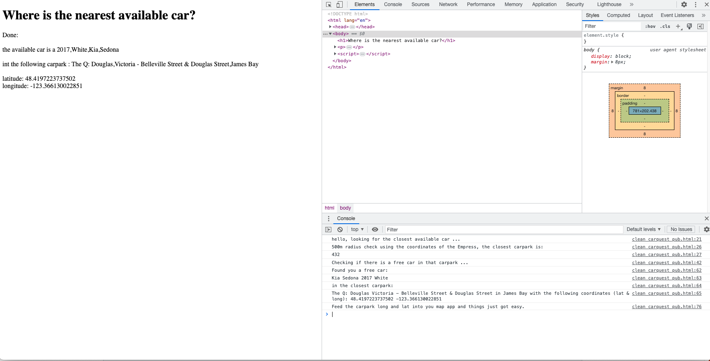

# carquest
First of all, a great holiday to you - hope you are having a good time already.

So, these are the steps to find nearby cars that are available for the next 12 hours.

Modo makes it easy to query their cars' details. They got [nice docs](https://bookit.modo.coop/api/v2#car_list) for their API, but I tried to get the gist of what you need to do here. No need to authenticate, but remember this is only for getting the information. We are just reading the information from the servers, you need to use the app in the end to make a booking. I am not detailing the endpoints in full here, please see their docs for further info.

These are the endpoints (JSON / GET or POST) 

|  name |  endpoint |  function |
|---|---|---|
|  Car List | https://bookit.modo.coop/api/v2/car_list |  all cars' details including base carpark|
|  Location List | https://bookit.modo.coop/api/v2/location_list  |  carparks and their details (long&lat)|
|  Nearby | https://bookit.modo.coop/api/v2/nearby  | list nearby carparks (no car info)|

## routine

I used Fetch API to sketch out a working routine. It does not take everything into account, but it is a good starting point. To check out the code and what it does, use Chrome with Developer Tools to open `empress_freecar.html` - this way you can see the console messages (image at end of this page). I just used urls with Fetch API, which means the method is GET. 

Made comments in the code to indicate which section does what, they are allcaps.
### (1) Check which carparks are nearby. 
Each car is assigned to a specific parking spot/base where it can be rented from and should be returned to. Use the `latitude` and `longitude` values of your hotel and I suggest using the `distance` parameter with 500 meters. If you think there are too many finds, you can decrease this distance but the chance of finding an available car becomes smaller.
```
https://bookit.modo.coop/api/v2/nearby?lat=48.42139&long=-123.36723&distance=500
```
The latitude and longitude in the code are variables, so you could use this routine to search for cars anywhere else.

So, what comes back is a number of 3-digit `LocationID`s that are nearby, I got six. 
`Neighbourhood` is a parameter on the carparks (`LocationID`s), so you could also list carparks in your own neighbourhood (Downtown) or adjacent to it (Harris Green, for example), but using the coordinates with distance is probably a more efficient move. This may just be relevant if you grow to like an area more and the distance is not the main concern.

The result that comes back is a *ranked list*, so the first one is the closest and the last one is the most far away carpark. 

### (2) Query all the modo cars and reformat JSON data. 
This gives you a gigantic list of Modo's cars (almost 900) with all the car details and their booking information.
```
https://bookit.modo.coop/api/v2/car_list
```
This is what one car entry looks like:
```
"600": {
        "ID": "600",
        "Make": "Fiat",
        "Model": "500",
        "Year": "2015",
        "Colour": "Red",
        "Identifier": null,
        "Category": "2-door Hatchback",
        "Class": "Car",
        "ExceptionClass": null,
        "Seats": "4",
        "Accessories": [
          "audio: aux input",
          "audio: bluetooth",
          "audio: mp3 cd player",
          "audio: usb audio",
          "cruise control"
        ],
        "Location": [
          {
            "LocationID": "383",
            "StartTime": null,
            "EndTime": null
          }
        ]
      }
```
Later on, we use the `LocationID` obtained in the first step to and filter to the cars that are currently in that chosen location. 

JSON reformatting part was tedious for me, I needed to perform some JSON conversions on the received data process it later otherwise I could not search it well. What I get back from the API call seems to be a complex nested JSON object, and I need a JSON array to feed to the search. There may be an easier solution than mine.

### (3) Check if there is an available car in the closest carpark.

Now that the JSON carlist the conversion is done, filter out the (only) car that is in the choosen spot and also check if it is available:

Nothing booked, free car:
```
"Location":[{"LocationID":"602","StartTime":null,"EndTime":null}]
```
Note that **both** need to be null. Your timezone in Victoria is America/Vancouver (PDT) and the offset (difference to Greenwich Time/GMT) is -07:00 or in seconds -25200.

I am just checking if `StartTime` and `EndTime` are both `null`, which is a but blunt and works only if there is a free car. A sophisticated routine should use `StartTime` and `EndTime` (convert to Epoch timestamps) to see if a car is available for 12 hours (between now and +44000 seconds). 44k secs is a little more than 12 hours, but making a choice and getting to the car also takes time. Cars can be booked well into the future, if a car has booked journeys it may not be relevant for you. If there are bookings on the car, the closest booking in time needs to have a `StartTime` of now plus 44000 secs in Epoch to be suitable for you. This is what a booked journey looks like:
```
"Location":[
{"LocationID":"734","StartTime":"1683896400","EndTime":"1683932400"},
{"LocationID":"734","StartTime":"1683205200","EndTime":"1683241200"}]
```
If there are no available cars in the nearest carpark, start checking the second nearest one and proceed down that list until you find one. Or theoretically there could be no cars in any of the carparks, then you need to enlarge your search radius. I found one car in that carpark all the time and it is never booked. I am not sure how likely this is, hope it is not a oversight on my part. I am not sure about it, I think if I found more cars in the nearest carpark, it would not break the flow but the HTML printout (step 5) would be messy. No cars would probably break it - this bit needs some improvement.
### (4) Get the full details of the closest carpark
Now that we know there is a free car in it, get the closest carpark's details.
```
https://bookit.modo.coop/api/v2/location_list?location_id=431
```
This step is necessary because the list of the nearest carparks (step 1) does not contain the an address or a name for the carpark, only the geocordinates.

An example `LocationID` (carpark):
```
"Locations": {
      "802": {
        "ID": "802",
        "Name": "Rupert Terrace",
        "ShortDescription": "Victoria - Rupert Terrace & Quadra Street",
        "Region": "Greater Victoria",
        "City": "Victoria",
        "Neighbourhood": "Downtown Victoria",
        "Latitude": "48.420932",
        "Longitude": "-123.361846",
        "ExceptionClass": null
      }
```
### (5) Show the properties of the available car and the closest carpark to the user.
Get the available cars' details to display the in the browser/app window. Make sure you show `Make` `Model` and `Colour`, so the car is easy to find.
```
https://bookit.modo.coop/api/v2/car_list?car_id=961
```
If there are multiple finds/cars, you could also list accessories of the available cars to help you choose.

### Chrome and devtools for console log


### Miscellenous issues

- If only `EndTime` exist and `StartTime`is `null`, then it is an ongoing booking? The car is not free.
- car in two locations/`LocationID`s ? is this commuting ? car number 1037, planned journey to another LocationID, not the origin one
- implement: if future booking is on car (Epoch time check) / StartTime and Endtime are NOT null but could be a free car. If StartTime is more than 44k secs away it is okay 
- implement:  if no free car is found in first/closest parking spot, need to start rerun carsearch using next closest carpark
- users seem to rent from 6am to 4pm - for 10 hrs 1037 and 1343 (could just be random occurance)
- lot of cars not in use?
